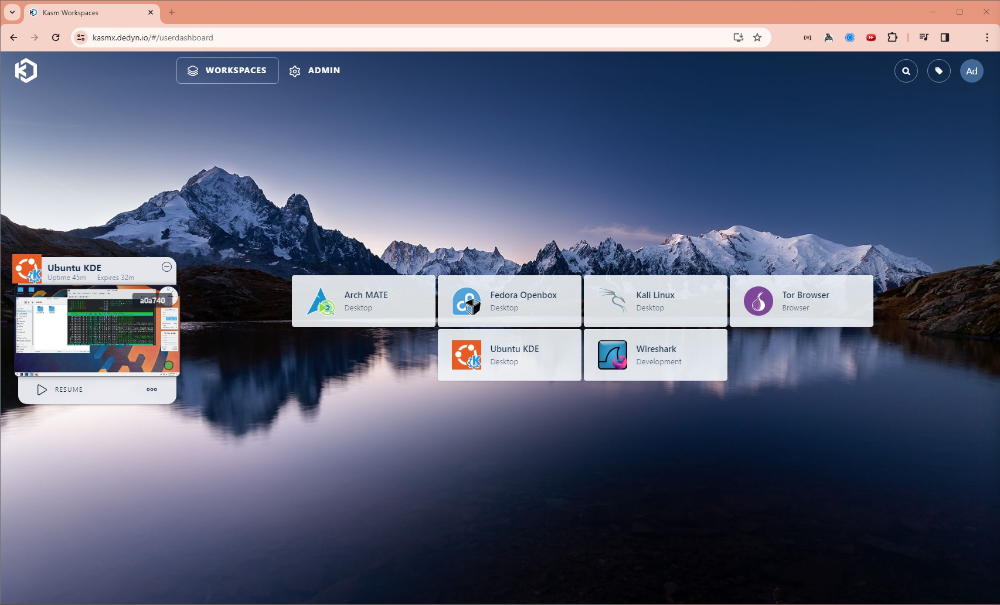
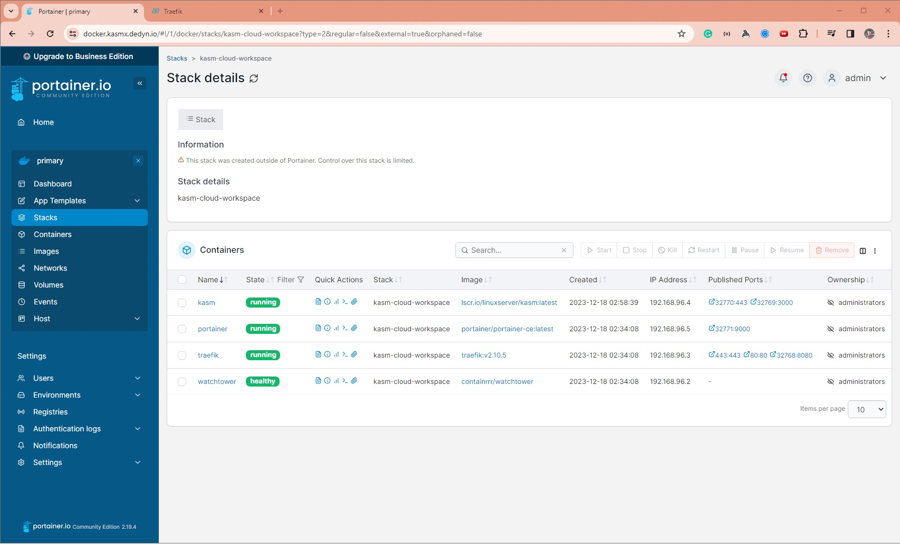

# kasm-cloud-workspace

Run Linux Desktop on Web for FREE - [KASM Workspace](https://kasmweb.com) on Oracle
Cloud - [Ampere A1 Compute Instance](https://www.oracle.com/cloud/compute/arm).

### Pre-requisite:

1. Create an Account in Oracle Cloud. See [Oracle Always Free Services](https://developer.oracle.com/free.html#always-free-services).
2. To create ARM Instance, refer [this documentation](https://docs.oracle.com/en-us/iaas/Content/Compute/References/arm.htm#create-instances).
3. To Launch a Linux Instance in Oracle
   Cloud, refer [this documentation](https://docs.oracle.com/en-us/iaas/Content/GSG/Reference/overviewworkflow.htm#Tutorial__Launching_Your_First_Linux_Instance).
4. Open ports 80 and 443 to allow HTTP Traffic. Refer [opening-up-port](https://dev.to/armiedema/opening-up-port-80-and-443-for-oracle-cloud-servers-j35)
5. Install [Docker in Ubuntu](https://docs.docker.com/engine/install/ubuntu).
6. Note down the Public IP Address of the instance - say `140.240.180.210`

> **Note**:
>
> While the above pre-requisite is given to setup a Linux Instance in Oracle Cloud ARM instance, this setup will work in
> other cloud providers like AWS, GCP, Azure as well.
>
> Simply create a Linux Instance, install Docker and open HTTP Ports. <br>
> Make sure to select an instance type with sufficient RAM and CPU to run multiple Linux Desktops.

### Deployment Instructions:

#### 1. Create a FREE Domain in https://desec.io:

1. Create an account in https://desec.io
2. Create a new Domain `YOUR_DOMAIN.dedyn.io` under https://desec.io/domains - Example: `apps.dedyn.io`
3. Add multiple A records in `YOUR_DOMAIN.dedyn.io` and point to the Public IP Address of the instance.

   | Type | Subname     | IP Address         | TTL (seconds) | Comments                                   |
   |------|-------------|--------------------|---------------|--------------------------------------------|
   | A    | (blank)     | `140.240.180.210`  | 3600          | points to `YOUR_DOMAIN.dedyn.io`           |
   | A    | `*`         | `140.240.180.210`  | 3600          | points to `*.YOUR_DOMAIN.dedyn.io`         |
   | A    | `docker`    | `140.240.180.210`  | 3600          | points to `docker.YOUR_DOMAIN.dedyn.io`    |
   | A    | `installer` | `140.240.180.210`  | 3600          | points to `installer.YOUR_DOMAIN.dedyn.io` |
   | A    | `proxy`     | `140.240.180.210`  | 3600          | points to `proxy.YOUR_DOMAIN.dedyn.io`     |
   > Note: For some reason the wildcard is not working and all other subname/subdomain had to be explicitly added.

4. Create and note down the DESEC Token under https://desec.io/tokens - say `YOUR_DESEC_TOKEN_STRING`

#### 2. Clone Repo:

```shell
git clone git@github.com:RawSanj/kasm-cloud-workspace.git && cd kasm-cloud-workspace
```

#### 3. Setup required environment variables:

```shell
# Set desec.io token created in Step 1.4
export DESEC_TOKEN="YOUR_DESEC_TOKEN_STRING"

# Set Traefik Credentials:
export TRAEFIK_CREDENTIALS=$(htpasswd -nbB admin "SuperSecretPassword")

# Set WORKING_DIR to point to cloned repo directory:
export WORKING_DIR="/path/to/kasm-cloud-workspace"
```

#### 5. Update Traefik Configuration:
1. Edit traefik/traefik.yml and set `YOUR_DOMAIN.dedyn.io` in `entryPoints.websecure.http.tls.domains` section and email for certificate expiry notifications from [Let's Encrypt](https://letsencrypt.org)
   ```shell
   # Run below command to replace exiting domain with your domain
   sed -i 's/apps.dedyn.io/YOUR_DOMAIN.dedyn.io/g' traefik/traefik.yml
   # Run below command to replace exiting email with your email
   sed -i 's/ADD_EMAIL@gmail.com/YOUR_EMAIL@example.com/g' traefik/traefik.yml
   ```
2. Edit traefik/config.yml and set `YOUR_DOMAIN.dedyn.io` in `tls.stores.default.defaultGeneratedCert.domains` section.
   ```shell
   # Run below command to replace exiting domain with your domain
   sed -i 's/apps.dedyn.io/YOUR_DOMAIN.dedyn.io/g' traefik/config.yml
   ```

#### 4. Run docker & Install KASM:
1. Start Docker Containers:
   ```shell
   docker-compose up -d
   ```
   1. When running this for the first time, docker will download all the images and start all the containers.
   2. [Traefik Proxy](https://traefik.io/traefik) will start the provisioning of Certificates using [DNS-01 Challenge](https://doc.traefik.io/traefik/https/acme/#dnschallenge) to enable automatic HTTPS via [Let's Encrypt](https://letsencrypt.org).    
2. Install and Run [KASM](https://kasmweb.com):
   1. Visit `https://installer.YOUR_DOMAIN.dedyn.io` to setup KASM credentials and Workspaces. You can add more Workspaces later via Admin UI.
   2. This will download several Docker Containers used by KASM and the Workspaces Containers in Docker-in-Docker mode.
   3. Once installation is completed, visit `https://kasm.YOUR_DOMAIN.dedyn.io` and login to start using KASM Workspaces.



#### 5. Manage Docker Containers using [Portainer](https://docs.portainer.io/user/docker/dashboard) Dashboard:
Visit `https://docker.YOUR_DOMAIN.dedyn.io` to start managing and deploying docker containers.
